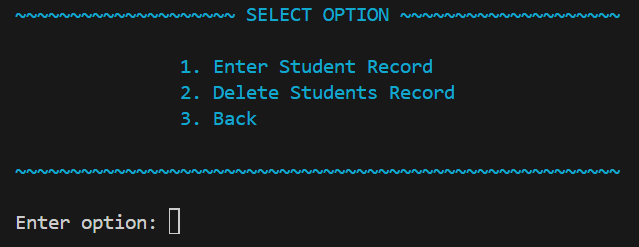
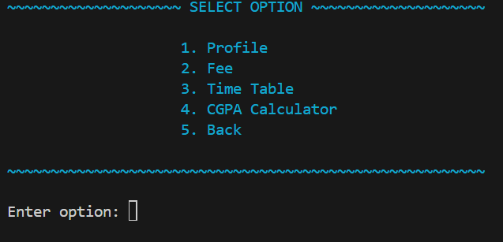

# Student Managment System

## Main Menu
 - The program is about student management system. In this program you can view and edit student record. In the starting the user will be given by three options:
    - Admin
    - Student
    - Quit (to end program)

## Admin Options 👨🏻‍💻

- The admin will be given further by 3 options:
    - Enter students record (i.e student name, ID, father's name, phone number, programme and section)
    - Delete students record
    - Quit (to go back to Main Menu)

## Student option 🎓

- The student will enter his/her name and roll number. The student will be given by:
    - Profile (will display all information of student from name to section)
    - Fee
    - Timetable
    - CGPA Calculator 
    - Back (to go back to Main Menu)

## Usage:
 - It is used to add and delete the record of students using admin options.
 - Student can :
    - view there profile 
    - calculate there fee according to the concession they have
    - time table for there whole week
    - calculate there CGPA according to GPA they got each semseter

